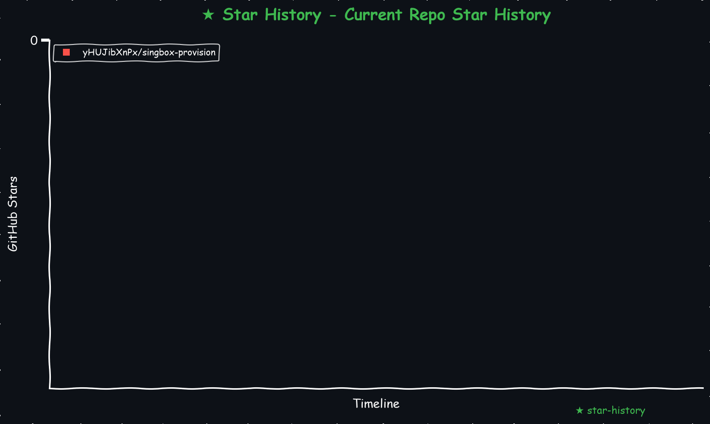

# singbox-provision
在一台全新的 Linux VPS 上自动搭建多协议 sing-box 服务

    
<!-- <a href="https://star-history.com/#yHUJibXnPx/singbox-provision&Date">
  <picture>
    <source media="(prefers-color-scheme: dark)" srcset="https://api.star-history.com/svg?repos=yHUJibXnPx/singbox-provision&type=Date&theme=dark" />
    <source media="(prefers-color-scheme: light)" srcset="https://api.star-history.com/svg?repos=yHUJibXnPx/singbox-provision&type=Date" />
    
  </picture>
</a> -->
<!-- START_STAR_HISTORY_SELF -->

<!-- END_STAR_HISTORY_SELF -->

一个命令行工具：在一台全新的 Linux VPS 上自动搭建多协议 sing-box 服务器
（VLESS Reality / Trojan Reality / VMess Reality / VMess WS+TLS / VLESS WS /
Hysteria2 / TUIC / AnyTLS），配一条 Cloudflare 隧道做抗封锁备用线路，生成
服务端配置、三份不同 sing-box 版本兼容的客户端配置、节点分享链接、订阅
文件，全部一次性跑完。

单个静态二进制，不依赖目标机器装任何东西（不需要 Python、不需要 jq，
连 sing-box/cloudflared 本体都是自己下载的）。

## 这是什么、不是什么

这个项目是 [make_sing-box_server_ubuntu.sh](https://github.com/yHUJibXnPx/make_sing-box_server_ubuntu)
的 Go 重写版——那是一份 2000 多行的 bash 脚本，做同样的事，但脚本越改越
难维护。这个仓库把它整个重写成了结构化的 Go 代码。原脚本名字里的
"_ubuntu" 对应的是脚本里几处 `apt install` 之类 Ubuntu/Debian 专属操作；
Go 版没有任何发行版专属调用（用到的 `sysctl`/`ufw`/`timedatectl` 在大多数
现代 Linux 发行版上都有），所以仓库名去掉了这部分，理论上不止 Ubuntu 能用，
但目前只在 Ubuntu 上实测过。

**我本人不会写 Go**。这份重写是跟 Claude（Anthropic 的 AI）一起、逐个模块
迭代做出来的：每一步都拿原脚本的真实产出物做逐字段比对、逐字节比对，
在 Docker 容器和真实 VPS 上跑通了完整流程，过程中发现并修掉了好几个原
脚本自己都不知道的 bug（细节全部记在 [docs/DEVELOPMENT_LOG.md](docs/DEVELOPMENT_LOG.md)）。
这不代表代码就一定没问题——我自己没法逐行审查 Go 实现细节，只能验证
"跑出来的结果对不对"。**如果你想在生产环境用它，或者想贡献代码，麻烦
自己过一遍 Go 源码，尤其是安全相关的部分（证书校验、密钥生成那几个包）。**
欢迎有 Go 经验的人来看代码、提 issue。

## 功能

- 自动探测一个支持 TLS1.3、证书体积合适的伪装域名（Reality 用）
- 自动分配互不冲突的端口，TCP/UDP 协议共用端口号以节省端口
- 自动下载并启动 sing-box（stable/testing 频道可选）和 cloudflared
- 生成服务端 `config.json` + 三份客户端配置（最新版 / OpenWrt / 兼容
  sing-box 1.11.4 的旧版）
- 节点自动按 tag 内容分类到对应地区分组
- 生成分享链接（vless/trojan/anytls/hysteria2/tuic/vmess）+ 明文/base64
  订阅文件
- 生成一份人类可读的 `result.txt` 汇总报告
- BBR、时间同步、ufw 防火墙放行

## 目录结构

    .
    ├── LICENSE                     # MIT 协议
    ├── README.md                   # 项目说明（就是这个文件）
    ├── export_nodes.py             # 解析sing-box服务产生的订阅节点脚本  
    ├── requestment.txt             # Python脚本所需依赖  
    ├── make_star_chart.py          # 生成 星星统计 脚本  
    ├── go.mod
    ├── cmd/
    │   ├── provision/              # 最终编排入口，实际部署用这个
    │   └── verify*/                # 每个模块各自的验证脚手架，调试用
    ├── internal/                   # 具体实现，见下方"项目结构"一节
    ├── testdata/                   # 用于验证的参考数据
    └── docs/
        └── DEVELOPMENT_LOG.md      # 详细开发过程、踩过的坑、跟原脚本的差异

## 使用方法（假设默认是 `$HOME` 目录）

1. 在能编译 Go 的机器上（不需要是目标 VPS 本身，交叉编译更方便）：

   ```bash
   git clone https://github.com/yHUJibXnPx/singbox-provision.git
   cd singbox-provision
   export CGO_ENABLED=0   # 见下方"关于 CGO_ENABLED=0"
   go test ./...          # 先确认测试全绿
   GOOS=linux GOARCH=amd64 go build -o provision ./cmd/provision   # 普通云主机
   # GOARCH=arm64                                                   # ARM 机型
   scp provision your-vps:$HOME/
   ```

   或者直接在目标 VPS 上装 Go 再跑：

   ```bash
   apt update && apt install -y golang-go
   export CGO_ENABLED=0
   go run ./cmd/provision -workdir $HOME
   ```

2. 在 VPS 上以 root 执行：

   ```bash
   chmod +x $HOME/provision
   $HOME/provision -workdir $HOME
   ```

3. 安装完成后，`$HOME` 下会生成：

   ```plaintext
    $HOME/
    ├── client.json                     # 支持最新版 sing-box 客户端配置
    ├── client_1.11.4.json              # 支持 1.11.4 版 sing-box 客户端配置
    ├── client_openwrt_sing-box.json    # 支持最新版 sing-box openwrt 客户端配置
    ├── cloudflared                     # cloudflare 透传主程序
    ├── cloudflared*.log                # cloudflare 日志
    ├── config/                         # sing-box 配置目录
    ├── config.json                     # sing-box 配置文件
    ├── result.txt                      # 汇总报告
    ├── sing-box.log                    # sing-box 日志
    ├── sing-box.version                # 记录实际下载到的 sing-box 版本号
    ├── sing-boxs/                      # sing-box 主程序目录
    │   └── sing-box                    # sing-box 主程序
    ├── subscription.txt                # 明文聚合节点
    └── subscription_base64.txt         # base64 聚合节点
   ```

   不再需要 `jq`——节点分类、版本探测这些原来要靠 jq 处理 JSON 的步骤，
   Go 版都是标准库原生做的，也就不会在目录里看到 `jq` 这个文件了。

4. ui 端口 `ip:9999`，混合代理端口 `ip:7890`。**1.11.4 内核版本（比如 iOS
   sing-box tv）访问 ui 只能用 `127.0.0.1:9999`，且不支持混合代理**——这是
   sing-box 那个版本自身的限制，不是这个工具能绕开的；`client_1.11.4.json`
   已经按这个限制生成（`external_controller` 绑定在 127.0.0.1）。

## 命令行参数

```bash
./provision -h
```

| 参数 | 说明 |
|---|---|
| `-workdir` | 工作目录，默认 `/root` |
| `-region-tag` | 节点 tag 前缀，比如"美国" |
| `-singbox-channel` | `stable` 或 `testing`（默认） |
| `-singbox-version` | 显式指定版本，跳过自动探测 |
| `-fingerprint` | uTLS 指纹类型，默认 `firefox` |
| `-cfnat-server` / `-cfnat-port` | 可选的 CF 节点 NAT 转发目标 |
| `-cf-proxyip` / `-cf-proxyip-port` | 可选的额外 Cloudflare ProxyIP |
| `-skip-cloudflared` | 不启动 cloudflared 隧道 |
| `-skip-firewall` | 跳过 ufw 防火墙放行 |

### 关于 `CGO_ENABLED=0`

这个项目没有用任何 C 绑定。Go 在 Linux 上默认只要检测到 `gcc` 就会用
cgo 版的域名解析，需要完整的 C 头文件才能编译——精简容器/镜像常常没装
全，会报一堆 `stdint.h: No such file or directory`。禁用 cgo 之后用 Go
自带的纯 Go 解析器，编译出来的二进制还会变成完全静态链接，不依赖目标
机器的 glibc 版本，跟"一个二进制丢到任意裸机 VPS 就能跑"这个目标更契合。

## 项目结构（`internal/` 每个包做什么）

```
internal/randgen/     UUID / 密码 / short-id / Reality 密钥对
internal/certgen/     自签名证书
internal/sbconfig/    服务端 config.json
internal/clientconfig/三份客户端配置
internal/classify/    节点按地区自动分类
internal/links/       分享链接 + 订阅文件
internal/netprobe/    Reality 伪装域名探测
internal/portcheck/   端口分配
internal/fetch/       下载 sing-box/cloudflared，探测公网身份
internal/procmgr/     启动/停止 sing-box、cloudflared
internal/sysconfig/   BBR、时间同步、防火墙
internal/report/      result.txt 报告
```

## 卸载（可选）

若要清理所有文件：

```bash
# 终止进程
pkill -9 -f "${HOME}/sing-boxs/sing-box"
pkill -9 -f "${HOME}/cloudflared"
# 删除资料
pushd "${HOME}"
rm -frv client_1.11.4.json client.json client_openwrt_sing-box.json config.json \
  result.txt subscription.txt subscription_base64.txt config \
  cloudflared cloudflared*.log sing-box.log sing-box.version \
  sing-boxs provision
popd
```

## 已知的局限 / 留给使用者决定的地方

- sing-box 和 cloudflared 都是"先短暂启动看日志、杀掉、再正式启动"的
  两阶段模式，照搬自原脚本，没搞清楚背后是不是在规避某个启动竞态。
- 没配置 cloudflared 隧道时，CF 节点表里几个不依赖隧道域名的字面
  Cloudflare IP 节点仍然会生成（连不通，`-skip-cloudflared` 目前不会
  额外跳过它们）。
- 三份客户端配置里的 12 个地区占位分组，原作者自己也不确定用途，功能
  上没有影响。
- `client.json`/`client_openwrt_sing-box.json` 的 Clash API 默认绑定
  `:9999`（所有网卡，无认证）；`client_1.11.4.json` 绑定
  `127.0.0.1:9999`（仅本机，1.11.4 内核本身也只支持这样绑）。前者如果
  用在不受信的网络环境下有被本地网段其他设备连上控制面板的风险，需要
  的话可以自己改成 `127.0.0.1` 或者加 `secret`。

更详细的每一步验证过程、发现的所有 bug、跟原脚本的每一处行为差异，见
[docs/DEVELOPMENT_LOG.md](docs/DEVELOPMENT_LOG.md)。

## 许可证

本项目采用 [MIT License](LICENSE) 许可。

## 联系与反馈

遇到问题或有改进建议，请在 [issues](https://github.com/yHUJibXnPx/singbox-provision/issues) 中提出。

## 参考

[原版 bash 脚本 make_sing-box_server_ubuntu](https://github.com/yHUJibXnPx/make_sing-box_server_ubuntu)  
[sing-box doc](https://github.com/SagerNet/sing-box)  
[sing-box](https://sing-box.sagernet.org)  
[cloudflared](https://github.com/cloudflare/cloudflared)  

# 声明
本项目仅作学习交流使用，用于解决生理需求，学习各种姿势，不做任何违法行为。仅供交流学习使用，出现违法问题我负责不了，我也没能力负责，我没工作，也没收入，年纪也大了，你就算灭了我也没用，我也没能力负责。